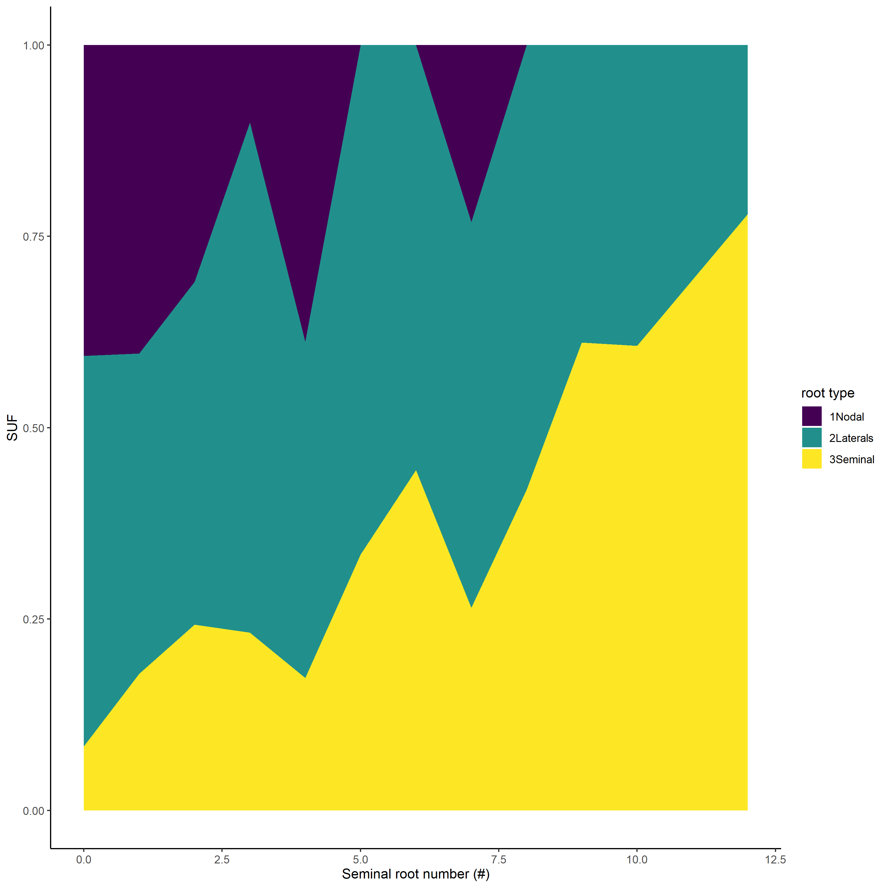
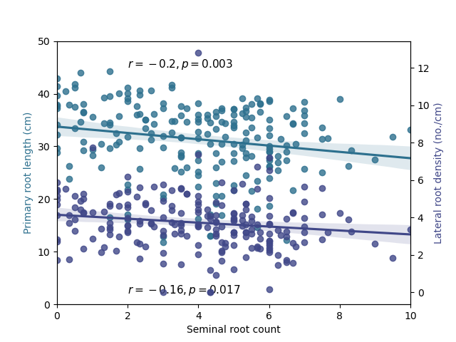

# Quantification of the Whole root system conductance

Script used for Figure 4 in Peng et al. 2023
## Methods

Run partial Hydraulic Viper (no soil)
- CPlantBox to generate root system architecture
- a meta-model calibrated from 8000 run of GARNAR-MECHA to get hydraulic conductivities from root diameter (works on maize plant only)
- MARSHAL to get the marco-hydraulic parameters

## files structure

- **data** : output data from Hydraulic Viper
- **www** : input data
- **img** : figure

## results

